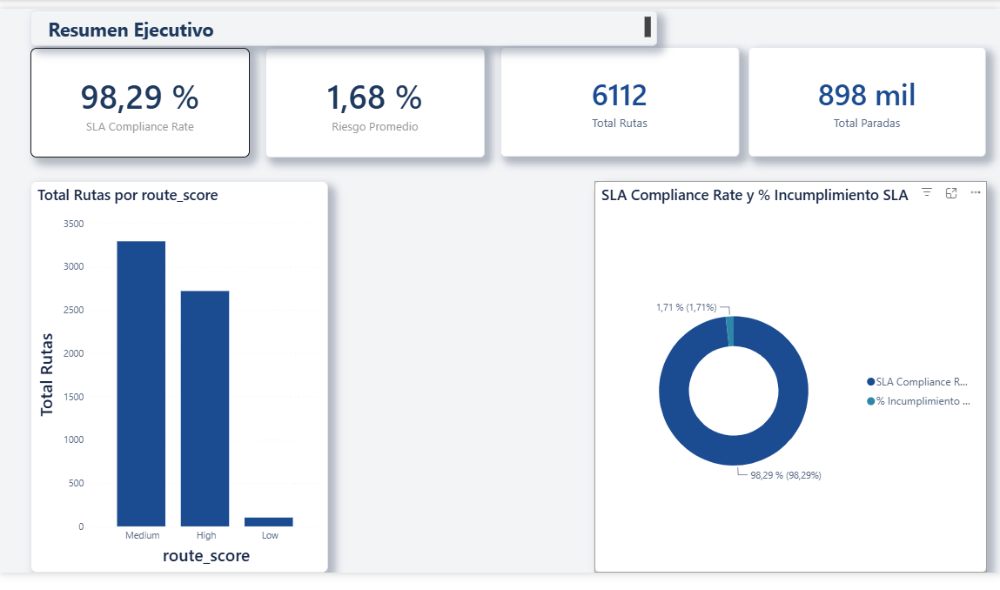
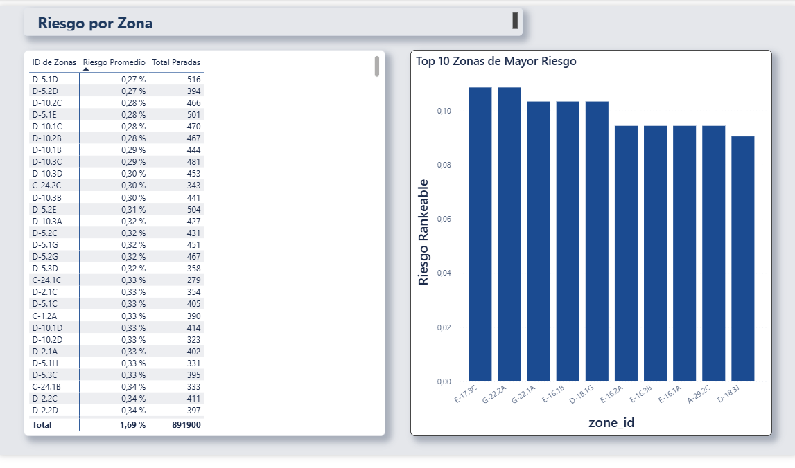
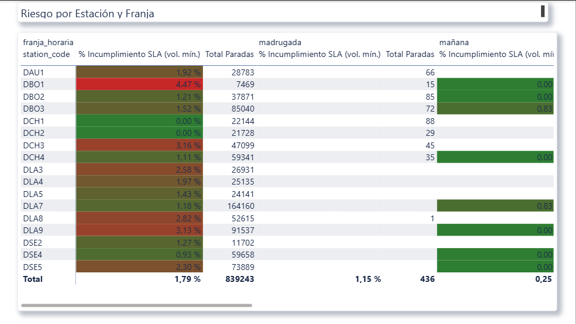
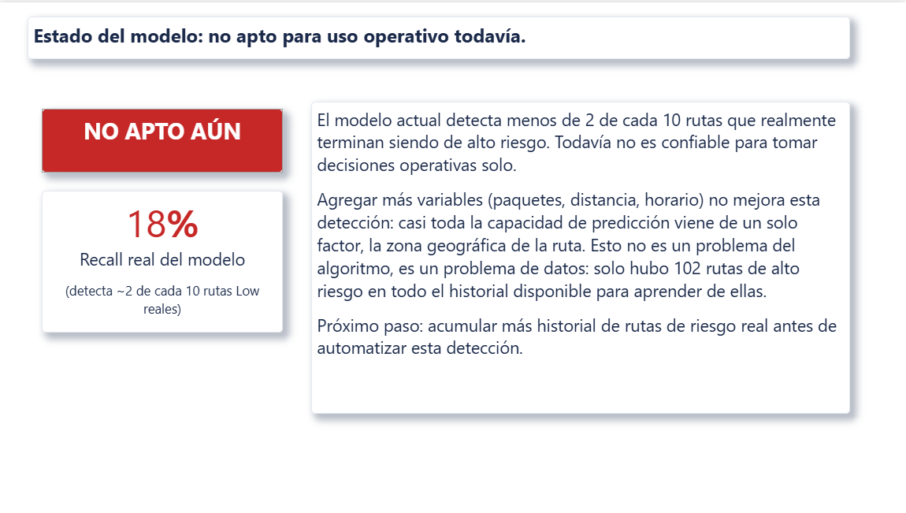

# Optimización de Rutas de Última Milla

Proyecto de portfolio — Fase 1 de **Insight Ops**, mi consultora de datos + IA aplicada a operaciones de reparto y última milla.

## Objetivo

Analizar el dataset [Amazon Last Mile Routing Research Challenge](https://registry.opendata.aws/amazon-last-mile-challenges/) para identificar patrones de riesgo de incumplimiento de SLA en la última milla, y construir un modelo predictivo de ese riesgo junto con un dashboard ejecutivo en Power BI.

## Por qué este proyecto

Antes de tocar un dataset de logística en Python trabajé adentro de una operación de última milla real: primero como courier y después como dispatcher en Amazon Logistics, Berlín. Como dispatcher gestionaba KPIs de cumplimiento — SLA, delivery rate, incidentes — sobre más de 50 rutas diarias, coordinando con couriers en alemán, inglés e italiano. No es una anécdota de CV: es la razón concreta por la que este proyecto está armado como está.

Desde ese lado del mostrador, "una ruta con riesgo de incumplir SLA" no es un concepto abstracto — es la ruta que un dispatcher mira dos veces antes de asignarla, o el reclamo que llega a la tarde porque una parada se demoró más de lo esperado. Este proyecto toma esa pregunta operativa (¿qué rutas o zonas tienen más probabilidad de fallar el SLA, y por qué?) y la lleva al terreno de datos: un modelo que estima ese riesgo por parada, y un dashboard pensado para que alguien en el rol que yo tenía pueda usarlo antes de asignar rutas, no solo para revisarlo después de que el problema ya pasó.

El análisis sí produjo un hallazgo estable y accionable: el riesgo de incumplimiento está fuertemente concentrado a nivel geográfico. La variable de riesgo por zona explica alrededor del 61% de la importancia del modelo, y por sí sola alcanza casi el mismo poder de detección que el modelo completo. Traducido a lenguaje operativo: hoy no se puede anticipar con confianza *qué ruta puntual* va a fallar, pero sí se puede decir *qué zonas concentran el incumplimiento* y por dónde conviene empezar a intervenir. Esa es la conclusión de negocio del proyecto, y es la que el dashboard pone adelante.

También es, a propósito, un proyecto honesto sobre sus propias limitaciones. El modelo actual detecta menos de 2 de cada 10 rutas de alto riesgo reales (recall ~18%) — no es apto para uso operativo todavía, y el dashboard lo dice así de claro en vez de maquillarlo. El cuello de botella no es el algoritmo: son apenas 102 rutas de alto riesgo en todo el historial disponible para entrenar. Prefiero mostrar ese límite con números en vez de vender un resultado que no sostendría frente a un cliente o en una entrevista.

Este es el primer proyecto de portfolio de Insight Ops — la fase de credibilidad antes de buscar clientes reales.

## Resumen técnico

- **Dataset:** [Amazon Last Mile Routing Research Challenge](https://registry.opendata.aws/amazon-last-mile-challenges/) — ~6,112 rutas, ~898,000 paradas.
- **Problema:** clasificación multiclase de riesgo de incumplimiento de SLA por parada (`Low` / `Medium` / `High`), con fuerte desbalance de clases (`Low` = 1.7% de las paradas).
- **Stack:** Python (Pandas, NumPy, Scikit-learn), Power BI (modelo tabular + DAX).
- **Entregables:** EDA con conclusiones de negocio, feature engineering, modelo baseline (regresión logística) e iteración con Random Forest, validación estadística de resultados, y dashboard ejecutivo de 4 páginas en Power BI.

## Definición del problema

El 93.4% de las paradas del dataset no tiene una ventana horaria de entrega prometida al cliente registrada, así que el riesgo de incumplimiento de SLA no se puede definir como "incumplimiento de ventana horaria" para la mayoría de los casos. La variable objetivo del modelo se apoya en cambio en `route_score` (`Low` / `Medium` / `High`), el indicador de calidad que Amazon calcula para el 100% de las rutas, propagado a cada parada de esa ruta como etiqueta débil (*weak label*).

**Por qué a nivel parada y no a nivel ruta:** con ~898K paradas en vez de ~6K rutas, el modelo cuenta con muchísimo más volumen para aprender patrones reales, y el resultado es accionable a nivel operativo — permite identificar qué paradas puntuales son de riesgo dentro de una ruta, en lugar de solo poder marcar la ruta completa como problemática sin poder decir por qué.

**Limitación aceptada explícitamente:** al propagar el score de una ruta a cada una de sus paradas, no todas contribuyeron por igual a ese resultado — es una etiqueta con ruido. Se acepta este trade-off porque el ruido no está correlacionado con las variables predictoras y se diluye con el volumen de datos: la diferencia real entre grupos (por ejemplo, zonas con más incidencia de rutas `Low`) sigue siendo detectable aunque una porción de las etiquetas individuales sea imprecisa.

## Feature engineering

A partir de las columnas disponibles se construyeron cinco variables nuevas:

- **Ventana horaria:** `window_duration_min` (duración de la ventana prometida al cliente, en minutos) y `franja_horaria` (madrugada/mañana/tarde/noche).
- **Densidad de paquetes:** `volumen_promedio_paquete_cm3`, `paradas_por_ruta` y `paquetes_por_ruta`.
- **Distancia:** `distancia_a_siguiente_km`, calculada con la fórmula de Haversine sobre el orden real de visita de cada ruta (`actual_sequences.json`), no sobre el orden en que las filas aparecen en la tabla.
- **Zona:** `zona_riesgo_low`, la tasa de `Low` por zona con **suavizado bayesiano** — calculada exclusivamente con el conjunto de entrenamiento para evitar fuga de datos, y corregida tras una pasada de QA para no confiar en zonas con muy pocas rutas de historia. Las zonas no vistas en entrenamiento reciben la tasa global de `Low` como valor de referencia.

**Split train/test:** sobre rutas completas (nunca paradas sueltas de la misma ruta repartidas entre ambos conjuntos) y estratificado por `route_score`, dado que la clase `Low` es solo 102 de 6,112 rutas (1.7%). Verificado: 0 rutas se repiten entre train y test, y la proporción de `Low`/`Medium`/`High` es casi idéntica en ambos conjuntos. Resultado: `data/processed/train.parquet` (719,870 paradas) y `data/processed/test.parquet` (178,545 paradas).

## Resultados del modelo

**Baseline (regresión logística):** `Low` — precision 0.02 / recall 0.18 / f1 0.04. `Medium` — 0.68 / 0.57 / 0.62. `High` — 0.55 / 0.50 / 0.52. Accuracy 0.53. ROC-AUC (ovr, macro) 0.6102.

**Random Forest** (`class_weight="balanced_subsample"`, `max_depth=12`): `Low` — precision 0.02 / recall 0.18 / f1 0.03. `Medium` — 0.66 / 0.58 / 0.62. `High` — 0.57 / 0.45 / 0.50. Accuracy 0.52. ROC-AUC (ovr, macro) 0.6029.

Cambiar a un modelo no lineal no mejora la detección de rutas `Low`: el recall es prácticamente idéntico entre los dos modelos (18%), y el ROC-AUC de la regresión logística es levemente mejor que el de Random Forest. Un Random Forest sin límite de profundidad memoriza train (100% en las tres clases) pero el recall de `Low` en test cae muy por debajo del modelo con profundidad limitada — evidencia de overfitting, no de aprendizaje real. `zona_riesgo_low` concentra ~61% de la importancia de features del Random Forest.

**Un modelo con una sola variable (`zona_riesgo_low`, nada más) obtiene ~17% de recall en `Low`** — prácticamente lo mismo que el modelo completo con las 14 features. Esto muestra que el cuello de botella no es el algoritmo ni la falta de features: es la falta de señal *nueva*, y probablemente el tamaño de muestra (solo 102 rutas `Low` en todo el dataset). Ningún modelo es confiable todavía para uso operativo — el dashboard lo comunica así, sin maquillar el resultado.

### Validación — hallazgos y una corrección propia

Antes de dar por cerrada esta etapa se corrió una pasada de validación sobre la metodología y los cálculos:

- **Significancia estadística, no solo intuición:** la diferencia de recall en `Low` entre el baseline sin suavizar (16%) y el modelo final (18%) se probó con un test de McNemar pareado sobre las mismas rutas `Low` de test — resultado estadísticamente significativo (p ≈ 0.00045). Aun así, la diferencia no es relevante para el negocio: en ambos casos el modelo deja pasar más de 8 de cada 10 rutas `Low` reales. Significativo estadísticamente no es lo mismo que significativo para el negocio.
- **Target encoding sin suavizar, corregido:** `zona_riesgo_low` usaba originalmente la tasa cruda de `Low` por zona. El 34% de las zonas de train tenían menos de 5 rutas de historia, y varias con 1 sola ruta `Low` quedaban con tasa = 100% — ruido con forma de señal fuerte. Se corrigió con suavizado bayesiano (`zona_riesgo_low = (n_low + k×tasa_global) / (n_rutas + k)`, `k=10`).
- **Un bug propio, encontrado al re-verificar:** la primera implementación del suavizado deduplicaba por `route_id` antes de agrupar por zona, sin considerar que una ruta visita muchas zonas distintas a lo largo de sus paradas — eso descartaba casi todas las zonas de cada ruta menos una. El síntoma fue un resultado inicialmente "espectacular" (recall de `Low` subiendo de 16% a 41%) que resultó ser un artefacto del bug, no una mejora real. Corregido deduplicando por el par `(zone_id, route_id)`. Un resultado sorprendentemente bueno amerita más sospecha, no menos.

## Dashboard ejecutivo (Power BI)

El archivo `.pbix` no se versiona en este repositorio — pesa ~46 MB y Git guardaría una copia completa por cada versión guardada, por el mismo criterio con el que se excluyen `data/` y `outputs/`. El dashboard tiene cuatro páginas, cada una con un objetivo de audiencia distinto:

### 1. Resumen Ejecutivo

Cuatro tarjetas KPI, distribución de rutas por `route_score` y gráfico de anillos (SLA Compliance Rate vs. % Incumplimiento SLA). Es la vista de entrada: el estado general de la operación en una pantalla.



### 2. Riesgo por Zona

Matriz por zona con riesgo promedio y volumen de paradas, más el ranking de las 10 zonas de mayor riesgo. Esta es la página que responde la pregunta accionable del proyecto — por dónde empezar a intervenir.



### 3. Riesgo por Estación y Franja

Matriz cruzada `station_code` x `franja_horaria` con % de incumplimiento y mapa de calor condicional. El volumen de paradas se muestra al lado a propósito, y el porcentaje solo se muestra cuando la celda tiene **al menos 100 paradas**: por debajo de ese umbral la celda queda vacía en vez de exhibir un porcentaje que mide azar y no operación. Con la tasa base de ~1,8%, 100 paradas equivalen a menos de 2 incumplimientos esperados — es el piso donde el número empieza a significar algo. La celda no se oculta: sigue mostrando su volumen, para que se vea que existe y que tiene poca historia.



### 4. Estado del Modelo

Traduce las métricas técnicas a lenguaje de negocio: qué tan confiable es el modelo hoy, y por qué, sin exponer métricas crudas de recall/ROC-AUC fuera de contexto. La página existe para que nadie use el modelo creyendo que es algo que todavía no es.



**Modelo tabular:** esquema de estrella con `Hechos_Paradas` (grano = parada, ~898K filas) y dos dimensiones, `Dim_Ruta` (route_id, station_code, date, route_score, executor_capacity_cm3) y `Dim_Zona` (zone_id, zona_riesgo_low), con relaciones varios-a-uno. 6,515 paradas (0.73%) sin `zone_id` se filtraron de las vistas por zona dado el volumen mínimo.

**Medidas DAX principales:** `SLA Compliance Rate` (98.29%), `Riesgo Promedio` (1.68%), `Total Rutas` (6,112), `Total Paradas` (898,415), `% Incumplimiento SLA`, y `% Incumplimiento SLA (vol. mín.)` — esta última aplica el umbral de volumen descrito arriba:

```dax
% Incumplimiento SLA (vol. mín.) =
IF (
    [Total Paradas] >= 100,
    [% Incumplimiento SLA],
    BLANK ()
)
```

Se resolvió con una medida y no con un filtro del objeto visual a propósito: un filtro habría eliminado filas enteras, perdiendo franjas de la misma estación que sí tienen volumen suficiente. La medida apaga únicamente la celda que no se sostiene.

## Próximos pasos

- Ampliar el historial de rutas de alto riesgo — el cuello de botella actual del modelo es volumen de señal, no algoritmo.
- Evaluar técnicas de manejo de desbalance de clases más allá de `class_weight` (oversampling, umbrales de decisión ajustados).
- Extender la cobertura geográfica de `Dim_Zona` para las paradas actualmente fuera de zona.
- Explorar secuenciación de paradas por riesgo dentro de una ruta ya definida, como extensión directa del modelo actual.

## Estructura del proyecto

```
codigo/
  notebooks/     → EDA, exploración, prototipado
  src/           → funciones reutilizables (limpieza, feature engineering) si el proyecto lo justifica
data/
  raw/           → dataset original, tal cual se descargó — nunca se edita a mano
  processed/     → datos limpios/transformados, generados por el código de codigo/
outputs/
  figures/       → gráficos exportados desde los notebooks
  models/        → modelo entrenado
```

`data/` y `outputs/` no se versionan en Git (ver `.gitignore`) porque son regenerables: cualquiera que clone este repo y corra los notebooks sobre el dataset público debería poder reproducir los mismos resultados.

## Cómo correrlo

1. Clonar el repositorio.
2. Descargar el dataset del [Amazon Last Mile Routing Research Challenge](https://registry.opendata.aws/amazon-last-mile-challenges/) y colocarlo en `data/raw/`.
3. Instalar dependencias: `pip install -r requirements.txt`.
4. Correr los notebooks en `codigo/notebooks/` en orden.

## Autor

Federico Giglio — [LinkedIn](https://linkedin.com/in/federico-oscar-giglio) · [GitHub](https://github.com/federicooscargiglio)
